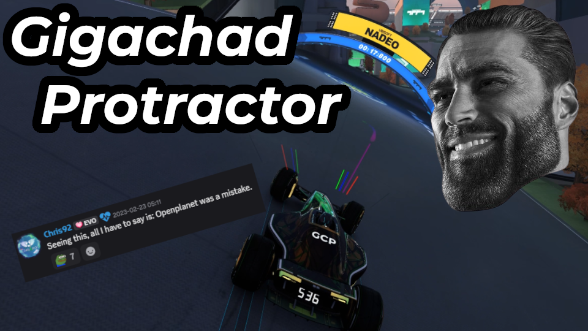

# Gigachad  Protractor

Draws lines to help you drive faster and understand Trackmania's physics. It works best for the Stadium car.

For more information on what this does, see these videos:

- [I Made the Ultimate Fullspeed Trainer](https://youtu.be/WN99mMP5TTU)
- [We Cracked the Code of Gears on Ice](https://youtu.be/jVlAvPqXzXA)

Originally created by [Devin](https://openplanet.dev/u/jschmitz2), as of February 2026 this is now being maintained by [Ezio](https://openplanet.dev/u/ezio416).

### Special thanks to the beta testers:
- [AR](https://openplanet.dev/u/st-AR-gazer)
- [XertroV](https://openplanet.dev/u/XertroV)
- [MisfitMaid](https://openplanet.dev/u/sylae)
- [Greep](https://openplanet.dev/u/89matt89)
- [nbeerten](https://openplanet.dev/u/nbeerten)
- [Ayr](https://openplanet.dev/u/Ayr)
- UnprovenRuben
- Bux
- Magpie
- Manama

